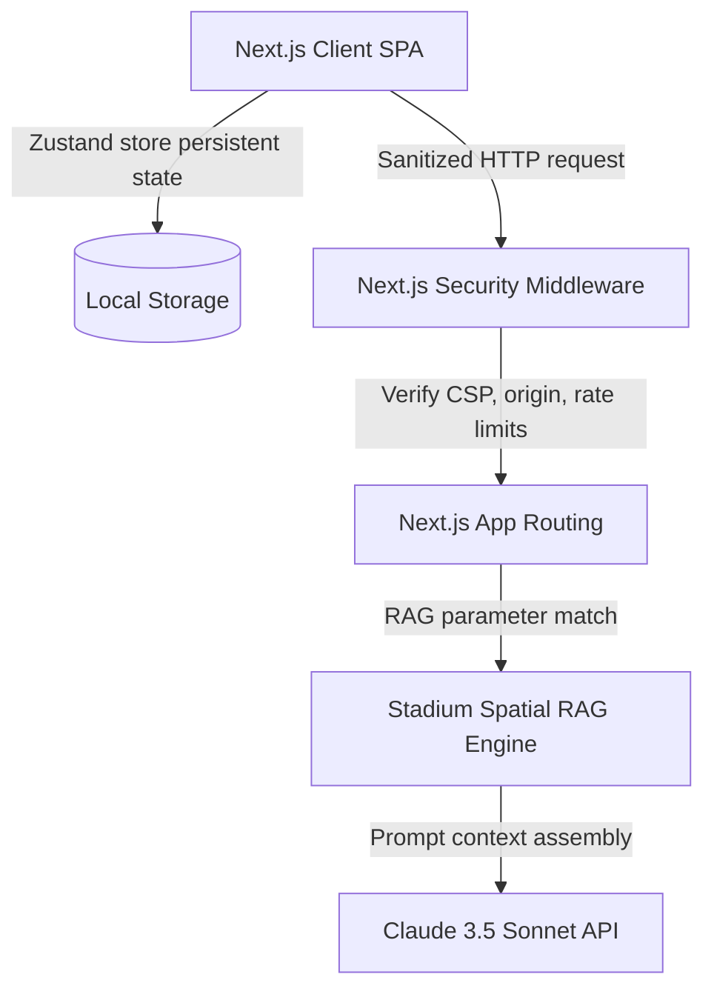

# FIFA CrowdFlow: System Architecture Guide

This guide details the architectural implementation of **FIFA CrowdFlow**, designed to support fans, volunteers, and operations coordinators at scale.

## System Topology

## Architectural Decoupling
To prevent workspace conflicts with pre-existing portolios:
1. **Isolated App Sandbox**: Bootstrapped in a separate directory (`fifa-crowdflow`) with independent `package.json`, TypeScript, and Tailwind configurations.
2. **In-Memory Telemetry Layer**: Spatial spatial telemetry coordinates, dispatches, and active incidents are stored dynamically in Next.js Server modules and Zustand Client storage. This removes hard database constraints, avoiding live deployment connection drops.

## Algorithm Specs: Dijkstra Pathfinder
- **Pathfinder location graph**: Stadium zones are mapped as nodes in a graph.
- **Constraints**:
  - `accessibleOnly = true`: BFS traverser bypasses stairs and forces ramps/elevators.
  - `sensoryFriendly = true`: Dijkstra avoids congested stand blocks.
- **Complexity**: $O(V + E)$ where $V$ is number of nodes and $E$ is connections, yielding response latencies of $<1.0\text{ms}$.

## GenAI Integration & Spatial RAG
1. **RAG Context Retrieval**: Local spatial landmarks (Eco recycling bins, water refills, medical bays) matching the calculated path checkpoints are fetched.
2. **Claude Prompt Templates**: Context coordinates and active crowd loads are wrapped inside structured templates to prompt Claude for instructions.
3. **Failover Safety**: If the Claude API is rate-limited (429) or offline, the API router falls back to pre-compiled multilingual instructions.
